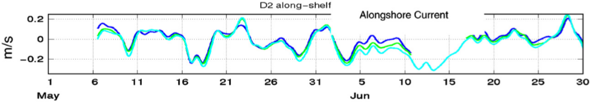
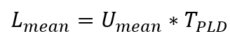
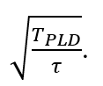
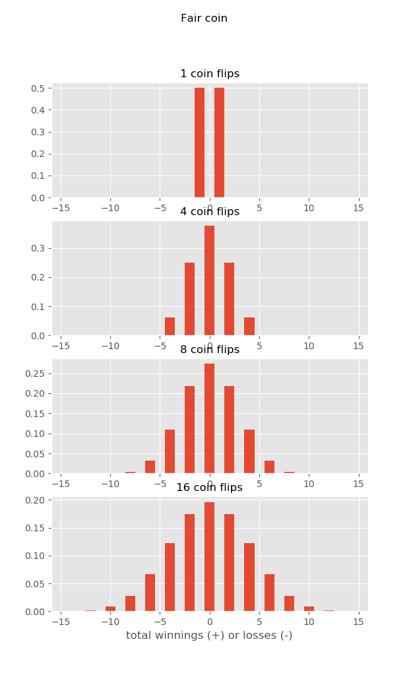
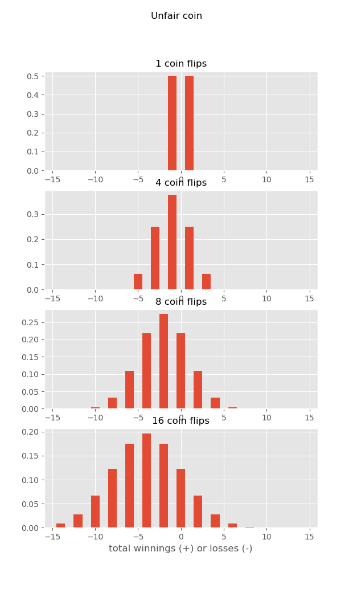

For the past few years, my colleagues and I have been looking at the implications of asymmetric dispersal of marine larvae on larval evolution (Pringle et al. 2014), biogeography (Byers & Pringle 2006, Pappalardo et al. 2015, Pringle et al. 2017), phylogeography (Pringle & Wares 2007, Wares & Pringle 2008, Pringle et al. 2011, Altman et al. 2013) and the spread of invasive species (Blakeslee et al. 2010, Byers et al. 2015).

But what is “asymmetric dispersal”? It is when the propagules of a species are preferentially transport in one direction along a coast or a river – i.e. when more larvae are swept “downstream” then are moved “upstream.” Much existing ecological and genetic theory assume otherwise – that propagules are spread equally in all directions in space (e.g. Fisher 1937, Rousset 1997). In our work, cited above, we find that in the ocean this asymmetric dispersal has strong effects – it reduces the evolutionary advantage of larval planktonic dispersal, it privileges genotypes that arise upstream, it increases the fecundity needed for a species to persist and the selection needed for a genetic cline to persist, among other things.

None of these oceanographic results are particularly surprising in light of an extensive literature on source/sink metapopulations – which are, of course, basically the same thing where propagules are more likely to go from one population to a second than in the opposite direction (e.g. Endler 1977, Nagylaki 1978). The main point of our papers is that these source/sink dynamics can be important in the ocean. But these leads to an obvious question: when are dispersal dynamics in the ocean asymmetric, when do they lead to source/sink dynamics? 

Of course, if larvae are released into a raging river, most of them will be swept downstream, few will move upstream against the torrents, and dispersal (if the larvae are passive) in such an extreme environment will be almost entirely unidirectional. But that is not what most ocean flows look like most of the time! 

For example, examine the following depth averaged alongshore currents from 90m depth just north of Pt. Reyes California (Largier et al. 2006):

The different color lines indicate depth in the water, and what is striking is how depth uniform the results are; the dynamics and forcing of this region are described in (Pringle & Dever 2009).

A positive current in this figure would sweep larvae northward – 0.2 m/s is about 20km per day. The mean is relatively weak (1.2 cm/s or about 1 km/day southward) and the standard deviation is about 7 cm/s or 6 km/day (Pringle & Dever 2009). So would a larvae released into this ocean be more affected by the mean southward transport? Would it experience a strong asymmetric dispersal and would the population be governed by source/sink dynamics?

At first it might seem that the answer will be determined exclusively by the ocean circulation. But this is not true! Look at the currents – they remain either northward (positive) or southward (negative) for several days before reversing direction. A significant portion of the time they are moving northward, against the average current – i.e. much of the time the current is moving “upstream”, as defined by the average current.

Now let us think of a larvae that is only in the plankton for a day or two. It is very nearly as likely to go “upstream” to the north as it is to go in the “downstream” direction, for nearly half of the time the observed velocity is positive. Sure, it is somewhat more likely to go south than north, but it will go in all directions – the predictions of theories which assume isotropic dispersal (same north as south) will not be too far wrong. 

But then think of larvae that will be in the water for the full 54ish days of the experiment. The fluctuations of the currents will be averaged over, and they will only experience the mean velocity, and they will all be swept downstream to the south…

But the former result is handwaving, and the latter result is to some extent an accident of the time period of the observations. So can we be more formal? Yes. Imagine the mean current in the season the propagules are released is Umean m/s, and the propagules are in the water a time TPLD. The mean distance they would be moved downstream would be 

If the propagules are in the water twice as long, they will move twice as far. Now if the speed of the water has a standard deviation of Ustd, what is the standard deviation of how far the larvae travel? Well, it depends on how long the water flows on average one direction before reversing – this is called the “decorrelation time scale” and is customarily called &tau. The variability of the dispersal, Lstd will then be

Immediately a difference is apparent – if the time in plankton TPLD is 2 times larger, the distance traveled is only 1.4 times (the square root of 2) bigger! 10 times longer, only about 3.2 times farther! (The derivations of these results can be found in many places, e.g. Siegel et al. (2003)).  

Thus the longer the larvae are in the water, the more the mean flow matters, since TPLD increase more quickly than the square-root of TPLD. When does the mean transport start to dominate over the fluctuation transport? When does source/sink start to win out over isotropic dispersal? If you calculate LmeanLstd, you can see that this ratio depends not only on the strength of the mean and fluctuating currents  Umean and Ustd, but also on the ratio

In much of the coastal ocean the mean and fluctuating parts of the current are of the same magnitude. In this common case, if the time the propagule is in the plankton is greater than the time between current reversals, the mean flow will tend to win and you will get source/sink dynamics – otherwise, the fluctuation current will tend to dominate and source/sink dynamics will be less important. In many coastal oceans, this time scale is a few days (e.g. Brink et al. 2003).

Why is this? For the same reason that the casino always wins… Imagine you are playing a silly game of coin-flip. Heads, you get a dollar (go north), tails, you loose a dollar (go south). What are the distributions of your winnings if you play the game a bunch of times? Well, half the time you win (go north), half the time you loose (go south), but on average you neither win nor loose…

But what if you play this game at a casino, and they charge you a quarter every time you play! This is like the average current, always sweeping you downstream. Now as you play, the longer you play, the more you loose on average – because each time you play the house wins a fixed amount. So if you play long enough, the house always wins… And if a larva stays in the plankton long enough, the mean current will always sweep it downstream, and you will have source sink dynamics…

### Biography

[Jamie Pringle](http://oxbow.sr.unh.edu) is a Professor in the Earth Sciences Department and a member of the institute of Earth, Oceans and Space at the University of New Hampshire. Jamie studies fluid dynamics, physical oceanography and their interactions with biological oceanography and genetics.

### Bibliography

Altman S, Robinson JD, Pringle JM, Byers JE, Wares JP (2013) Edges and Overlaps in Northwest Atlantic Phylogeography. Diversity 5:263–275.

Blakeslee AMH, McKenzie CH, Darling JA, Byers JE, Pringle JM, Roman J (2010) A hitchhiker’s guide to the Maritimes: anthropogenic transport facilitates long-distance dispersal of an invasive marine crab to Newfoundland. Divers Distrib 16:879–891.

Brink KH, Limeburner R, Beardsley RC (2003) Properties of flow and pressure over Georges Bank as observed with near-surface drifters. J Geophys Res 108:8001.

Byers JE, Pringle JM (2006) Going against the flow: retention, range limits and invasions in advective environments. Mar Ecol Prog Ser 313:27–41.

Byers JE, Smith RS, Pringle JM, Clark GF, Gribben PE, Hewitt CL, Inglis GJ, Johnston EL, Ruiz GM, Stachowicz JJ, Bishop MJ (2015) Invasion Expansion: Time since introduction best predicts global ranges of marine invaders. Sci Rep 5:12436.

Endler J (1977) Geographic variation, speciation, and clines. Princeton University Press, Princeton  N.J.

Fisher RA (1937) The wave of advance of advantageous genes. Ann Eugen 7:269.

Largier JL, Lawrence CA, Roughan M, Kaplan DM, Dever EP, Dorman CE, Kudela RM, Bollens SM, Wilkerson FP, Dugdale RC, Botsford LW, Garfieldg N, Cervantes BK, Koracin D (2006) WEST: A northern California study of the role of wind-driven transport in the productivity of coastal plankton communities. Deep-Sea Res Part II-Top Stud Oceanogr 53:2833–2849.

Nagylaki T (1978) Clines with asymmetric migration. Genetics 88:813.

Pappalardo P, Pringle JM, Wares JP, Byers JE (2015) The location, strength, and mechanisms behind marine biogeographic boundaries of the east coast of North America. Ecography 38:722–731.

Pringle JM, Blakeslee AMH, Byers JE, Roman J (2011) Asymmetric dispersal allows an upstream region to control population structure throughout a species’ range. Proc Natl Acad Sci 108(37):15288–15293.

Pringle JM, Byers JE, He R, Pappalardo P, Wares J (2017) Ocean currents and competitive strength interact to cluster benthic species range boundaries in the coastal ocean. Mar Ecol Prog Ser 567:29–40.

Pringle JM, Byers JE, Pappalardo P, Wares JP, Marshall DJ (2014) Circulation constrains the evolution of larval development modes and life histories in the coastal ocean. Ecology 95:1022–1032.

Pringle JM, Dever EP (2009) Dynamics of wind-driven upwelling and relaxation between Monterey Bay and Point Arena: Local-, regional-, and gyre-scale controls. J Geophys Res Oceans 114:C07003.

Pringle JM, Wares JP (2007) Going against the flow: maintenance of alongshore variation in allele frequency in a coastal ocean. Mar Ecol-Prog Ser 335:69–84.

Rousset F (1997) Genetic differentiation and estimation of gene flow from F-statistics under isolation by distance. Genetics 145:1219–1228.

Siegel DA, Kinlan BP, Gaylord B, Gaines SD (2003) Lagrangian descriptions of marine larval dispersion. Mar Ecol Prog Ser 260:83–96.

Wares JP, Pringle JM (2008) Drift by drift: Effective population size is limited by advection. BMC Evol Biol 8:235.

