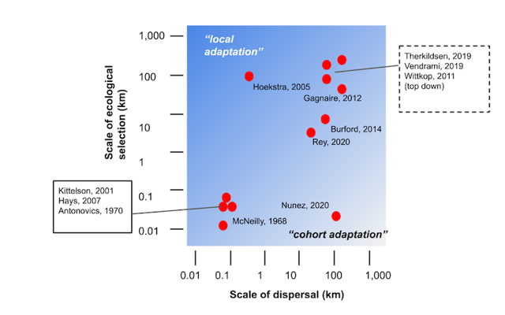
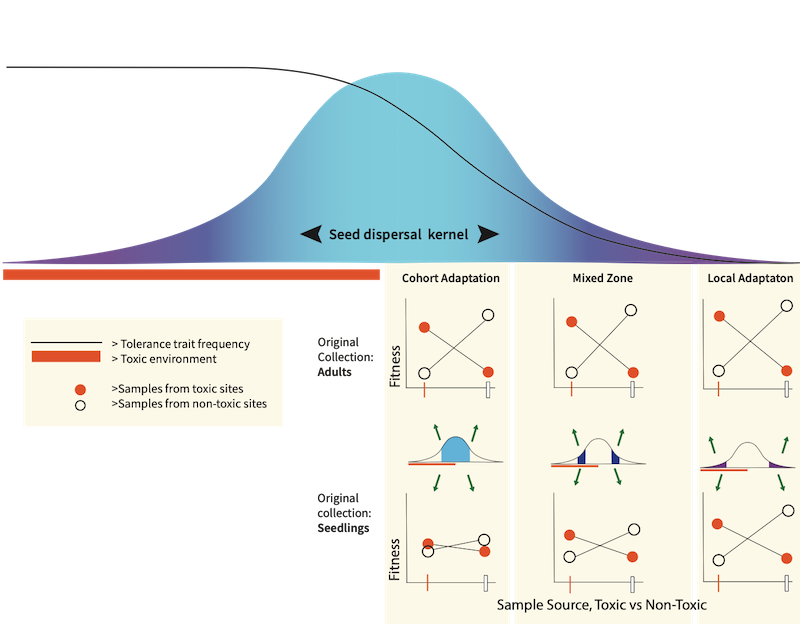

Evolution and adaptation are, by definition, multigenerational
processes. An exciting recent insight has been the extent to which
opposing forces of spatially diversifying selection and homogenizing
gene flow can result in local adaptation at small spatial scales
relative to average dispersal distances (Richardson et al. 2014).
Multiple mechanisms that can account for this result in theory, such as
habitat choice by dispersal propagules, potentially explain patterns
that have seemed surprising based on simple analytical theory. In this
blog post we focus on an underappreciated nonequilibrium process that
has been in plain sight all along, potentially confounding local
adaptation inferences, but has been considered trivial.

What importance does selection have, you might wonder, if high gene flow
prevents local adaptation? When Hermon Bumpus revived 72 out of 136
house sparrows he found downed by a violent winter storm in 1898, the
survivors had significant differences in weight and morphology that he
and later analysts attributed to natural selection (Bumpus 1899; Grant
1972). Episodic selection like this can be interesting and informative
to study, but probably changes little in the population’s evolutionary
trajectory.

In contrast, marine benthic species and many terrestrial plants are
sedentary as adults, highly fecund, and profoundly vulnerable to high
mortality in their earliest life stages during dispersal and soon after
settlement. When each female spawns tens of millions of eggs and larval
dispersal is broad there is much more potential for within-generation
responses to selection across habitat heterogeneities than if only a few
embryos are produced. For species with this life history it is not known
how much early mortality is effectively random (from a mix of factors)
versus selective across biophysical environmental gradients. However, a
few classic examples have demonstrated “adaptive” differentiation on
such a small spatial scale, recurring each life cycle, that no other
mechanism besides within-generation selection is possible to explain the
differentiation. Terms used in the literature to describe this process
include ‘phenotype-environment mismatch’, and ‘balanced polymorphism’
for the end result. Here, to put emphasis on the recurrent selection
regenerating differentiation in each cohort, we use “cohort adaptation”
to contrast with local adaptation (Fig. 1).

*Fig 1: Local adaptation vs. cohort adaptation. Examples of adaptive
differentiation plotted relative to the spatial scale of the selection
gradient vs average dispersal distance; summarized from examples in the
literature (after Sanford and Kelly 2011).*

Because microgeographic local adaptation is a potential equilibrium
result, spatial scale alone does not distinguish these phenomena. As
implied by the diagonal gradient in Fig. 1, local adaptation and cohort
adaptation likely occur simultaneously in some dispersal/selection scale
parameter space. Local adaptation is the component of adaptive
differentiation that is balanced with average gene flow over many
generations, and cohort adaptation ephemerally contributes
microgeographic differentiation in accordance with spatial environmental
variation experienced by a cohort.

It may help to describe some unambiguous examples where local adaptation
can be completely rejected as a contributing mechanism. Schmidt and Rand
(1999) documented cohort adaptation in the barnacle *Semibalanus
balanoides*. A desiccation selection gradient across intertidal zones
recurrently generated an allele frequency cline in adult barnacles that
was not present in settling juveniles. After a cycle of cohort
adaptation, adults just meters apart release offspring with very
different genotype frequencies at the mannose-6-phosphate (MPI) locus,
only to have them homogenized during months of pelagic larval dispersal
such that local adaptation is nearly impossible. For a long time the
best examples of cohort adaptation involved single loci of large effect,
but that may not be representative of its most pervasive effects. The
American eel (*Anguila rostrata*), for instance, is the quintessential
panmictic population because juveniles emerge from a common (presumably
well mixed) spawning ground in the Sargasso Sea and migrate
indiscriminately to estuaries along the entire eastern seaboard. Over
and over again, every life cycle, cohort adaptation differentiates eels
in Georgia vs Canada estuaries (macrogeographic scale; Gagnaire, 2012),
and in shallow polluted tributaries versus cleaner feeder streams of a
single estuary (mesoscale; La Porte, 2016). Cohort adaptation in this
case led to polygenic signatures of selection, apparently related to
life-history and tolerance phenotypes, respectively.

There are many ways in which cohort adaptation can have demographic and
ecological consequences, largely unexplored to date (but see Marshall et
al. 2010). Adaptive phenotypic plasticity has limits; where it is
insufficient to protect individuals from suboptimal environments cohort
adaptation can maintain population persistence or higher local fitness.
In this way, cohort adaptation potentially broadens the realized
physical niche beyond what plasticity allows. High fecundity and broad
dispersal confers a dynamic responsiveness to environmental
heterogeneity that likely makes species more resilient to environmental
change. Whereas local adaptation and even cohort adaptation can lag
behind environmental change in some long lived species like trees (Brown
et al. 2019), cohort adaptation in species with shorter generation times
can generate more temporally as well as spatially ‘fine tuned’ patterns
of local mean fitness. In addition, if mating is local then cohort
adaptation leads to genotypically distinct offspring getting produced in
different habitat patches so that genetic variance for traits under
selection is higher in the overall propagule pool than would be true
under a panmictic model. In theory, the higher genetic variance provides
a greater capacity for responses to selection by each new metapopulation
cohort, increasing mean fitness.

The evolutionary prediction that cohort adaptation maintains balanced
polymorphisms has long been appreciated in theory, but remains poorly
documented. A recent and fascinating exception is again with the
*Semibalanus* barnacle studied by David Rand’s lab in which they showed
(conservatively) that 4% of the transcriptome shows evidence of
polymorphisms that have persisted for at least a million years (Nunez et
al. 2020), far longer than expected under genetic drift.

On a more practical level, if our understanding of genotypic diversity
is shaped primarily by neutral patterns of gene flow and traditional
perspectives on adaptation then approaches to broodstock choice for
either selective breeding or hatchery-based population supplementation
could be suboptimal. For eastern oysters (*Crassostrea virginica*),
subject to both these breeding goals, broodstock collections anywhere in
an estuary might be considered genetically exchangeable. In fact, at
either end of the estuarine salinity gradient, and perhaps across other
environmental transitions as well (subtidal/intertidal; Li et al. 2018),
oysters differ at adaptive loci (Eierman and Hare 2015). The Hare Lab is
collaboratively investigating the genomic extent and repercussions of
cohort adaptation in Delaware Bay oysters in the Selection along
Estuarine Gradients in Oysters (SEGO) project, funded by NSF (with
co-PIs Daphne Munroe and Elizabeth North).

For a species experiencing cohort adaptation, conventional sampling of
adults to test for local adaptation will generate a positive result; for
example, average fitness will be higher at ‘home’ than the average
fitness measured for the same genotype transplanted to multiple ‘away’
habitats. Thus, for species susceptible to cohort adaptation, additional
analyses are required to distinguish cohort adaptation from local
adaptation because in many cases these processes will co-occur. What is
required to empirically separate these two processes? We want to
highlight two potentially useful approaches here. The first, depicted in
Fig. 2, predicts that the extent of observable cohort adaptation will
depend on the timing of sampling after dispersal and before selection on
a cohort is ‘complete’. Sampling of adults to set up common gardens will
show adaptive differentiation whereas sampling early post-settlement
juveniles (i.e., before much of the cohort selection), and setting up
common gardens with those juveniles, is expected to show much less or no
differentiation. The difference quantifies cohort adaptation for that
cohort. Because the traits under selection will be unknown in many
cases, another approach we are using in the SEGO project is to compare
whole genome sequences from population samples across an environmental
gradient and between survivors and nonsurvivors in experimental
challenges. Ideally these genomic comparisons should be made at several
life history stages. If the magnitude and genomic prevalence of adaptive
differentiation appears similar across the environmental gradient at
each life stage then cohort adaptation is rejected and we need to
revisit assumptions about the scale of homogenizing larval dispersal, or
the acuity of habitat choice.

*Figure 2: Empirically distinguishing effects of local adaptation and
cohort adaptation in the context of a sharp environmental transition
relative to average dispersal. In this conceptual diagram the analysis
of relative fitness is done with collections at different distances from
the environmental transition (varying the level of immigrant seeds from
across the transition) and with collections of adults vs. an early life
history stage (varying the degree to which cohort selection has acted
prior to sampling). The figure depicts results qualitatively expected
when cohort selection has a stronger impact near the environmental
transition and diminishing effects relative to local adaptation away
from the transition. If adults are collected for common gardens, cohort
adaptation combined with local adaptation make for strong fitness
differences all along the dispersal gradient. Collecting seedlings
(before cohort selection) removes cohort adaptation so that fitness
differences are attributable to local adaptation with different levels
of gene flow constraint.*

Darwin’s theory of natural selection was inspired in part by the
variation among conspecifics, the raw material of evolution which in
turn begets higher forms of diversity. Existing theory and examples have
taught us much about the emergent properties of populations at temporal
and spatial scales so small that evolutionary biologists often pass them
over. More empirical research into the conditions supporting cohort
adaptation, and its ecological and evolutionary impact will help us put
its effects into context relative to adaptive plasticity and local
adaptation. As anthropogenic activities transform the biosphere,
reshaping terrestrial and aquatic ecology at a rapid pace, our ability
to mobilize the genetic variation existing within and among populations
to mitigate this damage depends on how well we understand contemporary
population responses to selection.

We would be pleased to hear from you about the ideas in this blog post.

Avi Simon  
Junior Biological Sciences major at Cornell University 

Matthew Hare  
Associate Professor in the Department of Natural Resources and the
Environment, Cornell  
mph75\[at\]cornell.edu  

The Hare Lab uses genetics and genomics to investigate evolutionary (and
pseudo-evolutionary) processes that could constrain or facilitate
population responses to anthropogenic environmental change. These
processes include gene flow, adaptation, hybridization and
introgression, and population supplementation with domesticated strains.

### Literature Cited

Antonovics, J. & Bradshaw, A. D. Evolution in closely adjacent plant
populations VIII. Clinal patterns at a mine boundary. Heredity 25,
349–362 (1970).

Browne, L., Wright, J.W., Fitz-Gibbon, S., Gugger, P.F. and Sork, V.L.
Adaptational lag to temperature in valley oak (Quercus lobata) can be
mitigated by genome-informed assisted gene flow. Proceedings of the
National Academy of Sciences, 116(50), pp.25179-25185 (2019).

Bumpus, H.C. The elimination of the unfit as illustrated by the
introduced sparrow, Passer domesticus: (a fourth contribution to the
study of variation). Biol. Lect. Woods Hole Mar. Biol. Sta. 6: 209-226
(1899).

Burford, M., Scarpa, J., Cook, B. & Hare, M.P. Local adaptation of a
marine invertebrate with a high dispersal potential: evidence from a
reciprocal transplant experiment of the eastern oyster Crassostrea
virginica. Mar. Ecol. Prog. Ser. 505, 161–175 (2014).

Eierman, L.E. and Hare, M.P. Reef specific patterns of gene expression
plasticity in eastern oysters (Crassostrea virginica). Journal of
Heredity, special issue on phenotypic plasticity and evolution
107:90–100 (2015).

Gagnaire, P.-A., Normandeau, E., Côté, C., Møller Hansen, M. &
Bernatchez, L. The genetic consequences of spatially varying selection
in the panmictic American eel (Anguilla rostrata). Genetics 190, 725–736
(2012).

Grant, P. R. & Grant, B. R. Predicting microevolutionary responses to
directional selection on heritable variation. Evolution 49, 241–251
(1995).

Hays, C. G. Adaptive Phenotypic Differentiation across the intertidal
gradient in the alga Silvetia compressa. Ecology 88, 149–157 (2007).

Hoekstra, H. E., Krenz, J. G. & Nachman, M. W. Local adaptation in the
rock pocket mouse (Chaetodipus intermedius): natural selection and
phylogenetic history of populations. Heredity 94, 217–228 (2005).

Kittelson, P. M. & Maron, J. L. Fine-scale genetically based
differentiation of life-history traits in the perennial shrub Lupinus
arboreus. Evolution 55, 2429–2438 (2001).

Laporte, M. et al. RAD sequencing reveals within-generation polygenic
selection in response to anthropogenic organic and metal contamination
in North Atlantic eels. Molecular Ecology 25, 219–237 (2016).

Levene, H. Genetic Equilibrium When More Than One Ecological Niche is
Available. The American Naturalist 87, 331–333 (1953).

Levins, R. Evolution in Changing Environments: Some Theoretical
Explorations. (Princeton University Press, 1968).

Li, A., Li, L., Wang, W., Song, K. and Zhang, G., 2018. Transcriptomics
and fitness data reveal adaptive plasticity of thermal tolerance in
oysters inhabiting different tidal zones. Frontiers in physiology, 9,
p.825.

McNeilly, T. Evolution in closely adjacent plant populations III.
Agrostis tenuis on a small copper mine. Heredity 23, 99–108 (1968).

Nunez, J. C. B. et al. Footprints of natural selection at the
mannose-6-phosphate isomerase locus in barnacles. PNAS 117, 5376–5385
(2020).

Rey, C. et al. Within-Generation Polygenic Selection Shapes
Fitness-Related Traits across Environments in Juvenile Sea Bream. GENES
11, (2020).

Richardson, J. L., Urban, M. C., Bolnick, D. I. & Skelly, D. K.
Microgeographic adaptation and the spatial scale of evolution. Trends
Ecol Evol 29, 165–176 (2014).

Sanford, E. & Kelly, M. W. Local adaptation in marine invertebrates. Ann
Rev Mar Sci 3, 509–535 (2011).

Schmidt, P. S. & Rand, D. M. Intertidal Microhabitat and Selection at
Mpi: Interlocus Contrasts in the Northern Acorn Barnacle, Semibalanus
Balanoides. Evolution 53, 135–146 (1999).

Therkildsen, N. O. et al. Contrasting genomic shifts underlie parallel
phenotypic evolution in response to fishing. Science 365, 487–490
(2019).

Vendrami, D. L. J. et al. RAD sequencing sheds new light on the genetic
structure and local adaptation of European scallops and resolves their
demographic histories. Scientific Reports 9, 7455 (2019).

Warner, R. R. Evolutionary ecology: how to reconcile pelagic dispersal
with local adaptation. Coral Reefs 16, S115–S120 (1997).

Wittkopp, P. J. et al. Local adaptation for body color in Drosophila
americana. Heredity 106, 592–602 (2011).
